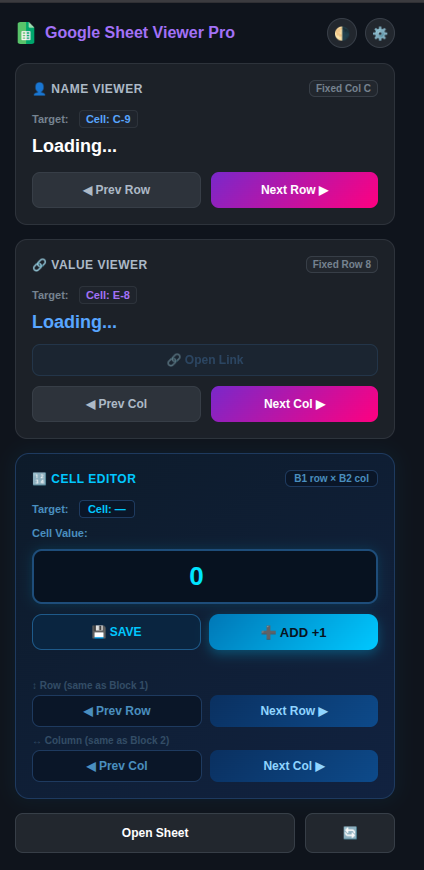
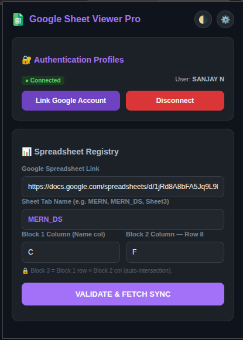

# 📊 Google Sheet Viewer Pro — Chrome Extension

A Chrome / Brave extension that lets you read, navigate, and write values to any Google Spreadsheet directly from your browser toolbar — authenticated via Google OAuth.

## A Chrome extension to view, navigate, and update Google Sheets cells directly from your browser toolbar ##

---

## 📸 Extension Preview

> What the popup looks like when loaded in Chrome / Brave.

<p align="center">
  
  &nbsp;&nbsp;
  
</p>

<p align="center">
  <em>Left: Main view with Name Viewer, Value Viewer &amp; Cell Editor &nbsp;|&nbsp; Right: Settings / OAuth configuration</em>
</p>

---

## 📁 Project Files

Every file in this folder has a specific role. `manifest.json` is the identity of the extension — it tells Chrome what permissions to request and which files to load. `popup.js` is the brain — it handles all OAuth login, Google Sheets API calls, and CRUD operations. The icon files are the visual identity shown in the toolbar and the Extensions management page.

```
simple-login-0.3/
├── manifest.json      ← Extension config (name, permissions, icons)
├── popup.html         ← Extension popup UI
├── popup.js           ← All logic: OAuth, Sheets API, CRUD
├── background.js      ← Service worker (minimal)
├── icon16.png         ← Toolbar icon (16×16)
├── icon48.png         ← Extensions page icon (48×48)
└── icon128.png        ← Chrome Web Store icon (128×128)
```

---

## ⚙️ Step 1 — Create a Google Cloud Project

Before the extension can communicate with Google services, you need a **Google Cloud Project**. Think of it as a container that holds all the settings, API access, and credentials for your app. Every Google API you use (like Sheets) must be linked to a project. This is free to create and takes less than a minute.

1. Go to → **https://console.cloud.google.com/**
2. Click **"Select a project"** → **"New Project"**
3. Give it any name (e.g. `sheet-viewer-pro`) → click **Create**

---

## 🔑 Step 2 — Enable the Google Sheets API

By default, a new Cloud Project cannot access any Google service. You must explicitly **turn on** each API you need. In this case, we need the Google Sheets API so the extension can read cell values, write updated counts, and sync data from your spreadsheet in real time.

1. In your project, go to **APIs & Services → Library**
2. Search for **"Google Sheets API"**
3. Click on it → click **Enable**

---

## 🆔 Step 3 — Create an OAuth 2.0 Client ID

> This is the most important step. The Client ID is what allows the extension to log in with Google.

The **OAuth Client ID** is a unique key that identifies your extension to Google's login system. When a user clicks "Link Google Account", Chrome sends this ID to Google so Google knows which app is requesting permission. Without it, the sign-in popup will fail immediately. The **OAuth consent screen** is the page users see when they are asked to grant access — you must configure it with the correct permission scopes so the extension can both read and write spreadsheet data.

1. Go to **APIs & Services → Credentials**
2. Click **"+ Create Credentials"** → choose **"OAuth client ID"**
3. If prompted, configure the **OAuth consent screen** first:
   - User Type → **External**
   - App name → anything (e.g. `Sheet Viewer`)
   - Add your email as a test user
   - Scopes → add:
     - `openid`
     - `email`
     - `profile`
     - `https://www.googleapis.com/auth/spreadsheets`
4. Back on Create Credentials → Application type → **Chrome Extension**
5. In the **"Item ID"** field, paste your **Extension ID** (see Step 5 below to get it)
6. Click **Create**
7. Copy the **Client ID** — it looks like:
   ```
   612679483614-xxxxxxxxxxxxxxxx.apps.googleusercontent.com
   ```

---

## 🛠️ Step 4 — Add Your Client ID to the Extension

The extension needs to know which OAuth Client ID to use when it builds the Google sign-in URL. This value is stored as a constant at the very top of `popup.js`. You simply **replace the existing placeholder** with the Client ID you copied from Google Cloud Console. This is a one-time change — after this, the extension always uses your credentials.

Open `popup.js` and find **line 2–3** at the very top:

```js
// ─── Constants ───────────────────────────────────────────
const OAUTH_CLIENT_ID =
  "612679483614-7i9h2j9rpob401rk0l81dogu7kgvsdml.apps.googleusercontent.com";
```

**Replace the string** with your own Client ID:

```js
const OAUTH_CLIENT_ID = "YOUR_CLIENT_ID_HERE.apps.googleusercontent.com";
```

Save the file.

---

## 🔌 Step 5 — Load the Extension in Chrome / Brave

Chrome extensions loaded from a local folder (instead of the Web Store) are called **unpacked extensions**. You load them using Developer Mode. Once loaded, Chrome assigns your extension a unique **Extension ID** — a 32-character string that Google uses to verify the origin of OAuth requests. You need this ID to complete Step 3 on Google Cloud Console.

1. Open Chrome → go to `chrome://extensions`
2. Enable **Developer Mode** (top-right toggle)
3. Click **"Load unpacked"**
4. Select the `simple-login-0.3/` folder
5. The extension appears in your toolbar — **copy the Extension ID** shown under its name  
   (e.g. `abcdefghijklmnopqrstuvwxyzabcdef`)

> Go back to **Step 3** and paste this Extension ID into your OAuth Client ID configuration if you haven't already, then save on Google Cloud Console.

---

## 🔄 Step 6 — Reload & Test

Any time you edit source files (`popup.js`, `popup.html`, `manifest.json`), Chrome does **not** pick up the changes automatically — you must manually reload the extension. After reloading, click the toolbar icon to open the popup and confirm it displays the UI correctly before logging in.

1. Back on `chrome://extensions`, click the **🔄 reload** button on the extension
2. Click the extension icon in the toolbar — the popup opens
3. Click the **⚙️ settings** icon (top right of popup)

---

## 📋 Step 7 — Configure Your Spreadsheet

This is where you connect the extension to your actual Google Sheet. The extension needs the **full URL** of the sheet, the **tab name** (the sheet name shown at the bottom of Google Sheets), and the column letters that correspond to your data layout. Once saved, the extension uses these settings every time it fetches or writes data.

Inside the Settings page:

| Field | What to enter |
|-------|---------------|
| **Google Spreadsheet Link** | Full URL from your browser, e.g. `https://docs.google.com/spreadsheets/d/1aBc.../edit` |
| **Sheet Tab Name** | The tab name inside the sheet, e.g. `MERN_DS`, `Sheet1` |
| **Block 1 Column** | The column letter for names (default `C`) |
| **Block 2 Column** | The column letter for values/links (default `F`) |

Then click **"Validate & Fetch Sync"** — this triggers the Google OAuth login popup.

---

## ✅ How OAuth Login Works (Behind the Scenes)

Understanding how the login flow works helps you debug issues faster. The extension uses Chrome's built-in `chrome.identity` API instead of a backend server, so no passwords are ever stored. Chrome handles the secure redirect, extracts the token from the URL, and the extension saves it locally. Every API call to Google Sheets then sends this token as a header to prove the user is authenticated.

When you click **"Validate & Fetch Sync"** or **"Link Google Account"**:

1. The extension calls `chrome.identity.getRedirectURL()` to build the redirect URI automatically
2. It opens a Google sign-in popup via `chrome.identity.launchWebAuthFlow`
3. Google returns an **access token** in the URL hash
4. The token is stored in `chrome.storage.local` under the key `oauth_access_token`
5. All Sheets API calls use this token in the `Authorization: Bearer <token>` header

**Scopes requested:**
```
openid  email  profile
https://www.googleapis.com/auth/spreadsheets
```

The `spreadsheets` scope is required to **read and write** cell values.

---

## 🧩 Extension Blocks Explained

The popup UI is divided into three independent blocks, each targeting a specific part of your spreadsheet. Block 1 and Block 2 can navigate independently, and Block 3 always shows the cell at the **intersection** of Block 1's current row and Block 2's current column — making it easy to update a specific data point without manually searching for the cell.

| Block | What it does |
|-------|-------------|
| **Block 1 — Name Viewer** | Reads column C (configurable), navigates by row — shows the topic/name at the current row |
| **Block 2 — Value Viewer** | Reads row 8 (fixed), navigates by column — shows the category label or link for the current column |
| **Block 3 — Cell Editor** | Reads/writes the intersection of Block 1's row × Block 2's column — use +1 to increment a counter or SAVE to write a custom value |

---

## 🗝️ Storage Keys (chrome.storage.local)

The extension stores all its configuration and session data in Chrome's local storage — this means settings persist across browser restarts without needing a server. The OAuth token is also saved here so the user does not have to log in every time the popup is opened (until the token expires).

| Key | Value stored |
|-----|-------------|
| `oauth_access_token` | Google OAuth access token |
| `sheet_url_path` | Full Google Sheets URL |
| `sheet_name` | Sheet tab name (e.g. `MERN_DS`) |
| `b1_col` | Block 1 column letter |
| `b2_col_idx` | Block 2 column index (number) |
| `b1_row` | Last active row for Block 1 |

---

## 🚨 Common Issues

Even when everything is set up correctly, small mismatches between the Extension ID and OAuth credentials can cause silent failures. Use these targeted fixes to resolve the most frequent problems quickly.

### ❌ "OAuth Client ID not found" or blank popup
- Make sure you replaced `OAUTH_CLIENT_ID` in `popup.js` with your real Client ID
- Reload the extension after saving

### ❌ Login popup appears but immediately closes
- Your Extension ID is not added to the OAuth Client ID on Google Cloud Console
- Go to Credentials → edit your OAuth Client ID → add the correct Extension ID

### ❌ "Access denied" / 403 on Sheets API
- You did not add `https://www.googleapis.com/auth/spreadsheets` scope in the consent screen
- The Google account used is not a test user (add it in the OAuth consent screen)

### ❌ Extension doesn't reload token after browser restart
- Tokens from `launchWebAuthFlow` can expire — click **"Validate & Fetch Sync"** again to re-authenticate

---

## 🧪 Quick Checklist Before First Use

Run through this list before testing. Every item must be checked — a single missing step will cause the login or data fetch to fail silently.

- [ ] Google Cloud Project created
- [ ] Google Sheets API enabled
- [ ] OAuth consent screen configured with correct scopes
- [ ] OAuth Client ID created (type: Chrome Extension)
- [ ] Extension loaded in Chrome → Extension ID copied
- [ ] Extension ID added to OAuth Client ID on Google Cloud
- [ ] `OAUTH_CLIENT_ID` in `popup.js` updated with your Client ID
- [ ] Extension reloaded
- [ ] Spreadsheet URL + tab name entered in Settings

---

## 📬 Support

If authentication fails, open Chrome DevTools on the popup (`right-click popup → Inspect`) and check the **Console** tab for error messages. Most errors will clearly state whether the issue is a missing Client ID, an invalid token, or a scope/permissions problem on the Google Cloud side.
